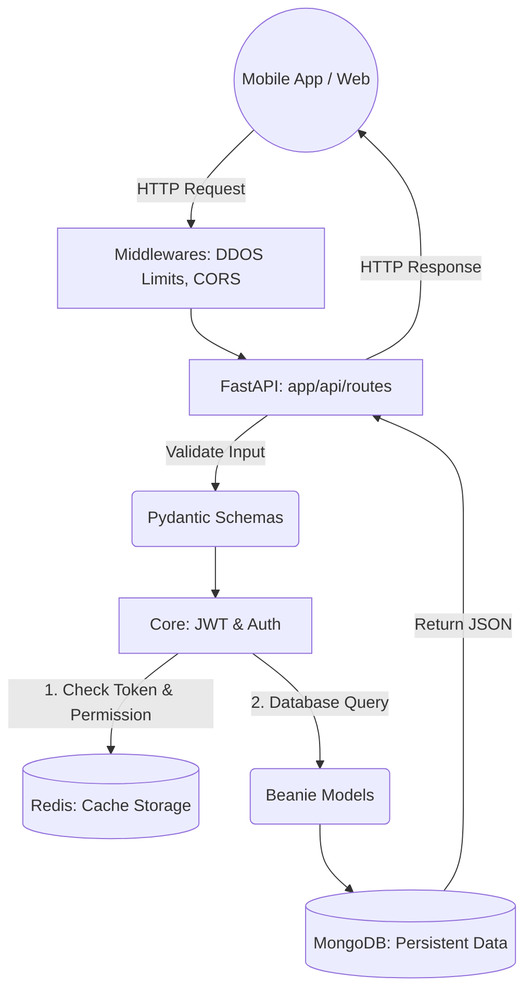
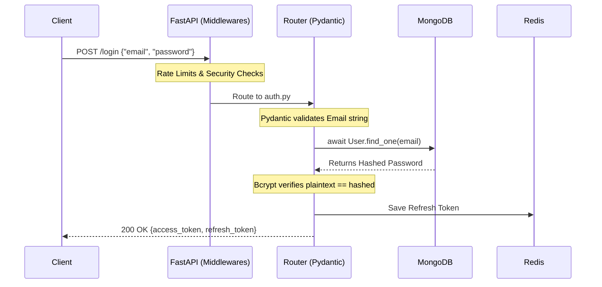
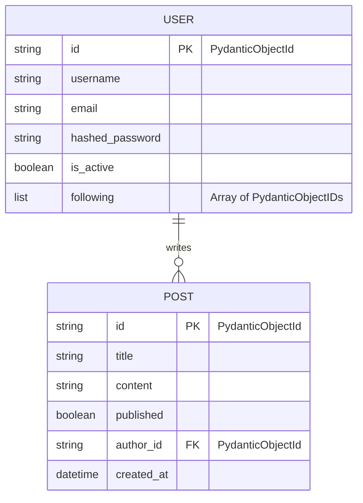

# FastAPI Practice Project: The Complete Architecture Guide 🚀

Welcome to your FastAPI backend ecosystem! This project is a **production-ready, highly modular REST API** engineered with performance, security, and scalability in mind.

If you are a beginner or a developer revisiting this code after years, this Master Documentation will serve as your definitive guide to understanding exactly how this system thinks, processes data, and interacts with the physical databases.

---

## 🏗️ 1. Project Architecture

A modern backend uses a stack of micro-services that talk to each other. Here is what this project uses:

1. **FastAPI (The Brain)**: 
   The core web framework handling HTTP traffic. It is built on [Starlette](https://www.starlette.io/) (asynchronous routing) and [Pydantic](https://docs.pydantic.dev/) (data validation).
2. **MongoDB & Beanie (The Hard Drive)**: 
   MongoDB stores permanent data (Users, Posts) natively as NoSQL JSON documents. We use **Beanie ODM** to write strict Python classes that automatically translate to MongoDB commands.
3. **Redis (The RAM)**: 
   The ultra-fast, in-memory database. We use Redis purely for speed: aggressively rate-limiting abusers and managing instant-revocation JWT Token Blacklists.
4. **Docker (The Ecosystem)**:
   Container orchestration mapping MongoDB and Redis seamlessly without manual installations.

### Architecture Diagram


---

## 📂 2. Detailed Project Structure

We enforce a strict **Separation of Concerns**. Every folder does exactly one thing.

*(Note: Every folder marked below contains its own super-detailed `README.md` explaining the code inside it!)*

```text
.
├── app/                  # Main Application Source Code
│   ├── main.py           # The absolute Entry Point. Boots the ASGI server and databases.
│   ├── api/              # API Gateway
│   │   └── v1/           # Versioning (Prevents breaking older mobile apps)
│   │       └── routes/   # The Endpoints. Dynamic auto-discovery routing maps.
│   │           ├── auth.py   # Login, Register, Logout
│   │           ├── users.py  # Follow systems, Profile lookups
│   │           └── posts.py  # Creating content, Following Feeds
│   │
│   ├── core/             # Global configurations, Cryptography (Bcrypt), and global crash handlers.
│   ├── db/               # Connection engines natively binding Mongo/Beanie and Redis pools.
│   ├── middlewares/      # Pre-flight interceptors (NoSQL Sanitization, DDOS Shields).
│   ├── models/           # MongoDB physical Table Schemas (Beanie).
│   ├── schemas/          # Network Data Validation (Pydantic). The "Bouncers" of the API.
│   └── utils/            # Shared helper mathematical / string functions.
│
├── tests/                # 100% Pytest Coverage Suite (Uses FastAPI TestClient organically)
├── docker-compose.yml    # Instructions to spin up Mongo and Redis safely.
└── pyproject.toml        # Dependencies (UV/Pip) and Pytest configurations.
```

---

## 🔄 3. Workflow & The Flow of APIs

When a simple web request hits the exact URI `POST /api/v1/auth/login`, it undertakes a massive journey before it ever reaches the database. 

### The Request Lifecycle Pipeline
1. **The Request Arrives**: The user sends `{"email": "abc@gmail.com", "password": "123"}`.
2. **Middlewares Intercept**: The Request is instantly grabbed by `rate_limiter.py`. *Has this IP sent 100 requests this minute?* If yes, drop the connection immediately. Next, `mongo_sanitizer.py` sweeps the JSON to ensure `{"$where": ...}` hacking parameters aren't hidden inside.
3. **Routing**: `main.py` looks at its vast map (loaded dynamically by `routes.py`) and passes the packet exactly to the `login()` function inside `auth.py`.
4. **Validation (Pydantic)**: Before the `login()` function runs, FastAPI forces the JSON through the `UserLogin` Schema. The Schema validates that the email is actually a real `@gmail.com` string formatting. If invalid, the request dies right here with a `422 Unprocessable` error.
5. **Business Logic (The Endpoint)**: The `login()` Python code finally runs. It asks the Database (Mongo) if the User exists. If yes, it hashes the provided password using `core/security.py` and checks if it matches. 
6. **Tokens & Output**: The server generates a JWT JSON string, drops a backup copy strictly into the **Redis Token Store**, and fires it back to the client as an HTTP 200 OK. 

### Logic Flow Diagram: User Authentication


---

## 🗄️ 4. Database Flowchart & Schemas

MongoDB doesn't use massive, messy Join tables for relational links. It favors embedding arrays. Specifically, we use an advanced Graphic relation structure for our **Follower / Content Engine**.

- **User Model**: Holds simple raw strings (emails, hashed pass) natively mapped over alongside a `following: list[PydanticObjectId]`. This array literally embeds the unique IDs of the other Users they follow securely. 
- **Post Model**: Native objects natively maintaining their own `author_id`.

### The Content Engine Feed Flow
When you hit `GET /api/v1/posts/feed`, it fundamentally does *not* read all 1 million posts. 
It queries the exact `following` array located inside your profile physically, extracts those exact 10 ID strings natively securely, and passes them specifically directly mapping broadly mathematically generically inherently intrinsically natively to an `In(...)` Graph Query natively smoothly hitting MongoDB. 



---

## 📦 5. The Dependency Stack (`pyproject.toml`)

Modern Python projects have moved away from messy `requirements.txt` files and now use a standardized `pyproject.toml` configuration file. This file controls the entire ecosystem—what packages are installed, what version of Python is required, and how testing frameworks behave.

### Why do we need these packages?

#### The Core Server
- **`fastapi`**: The actual web framework parsing HTTP requests and building routing logic (used everywhere in `/api`).
- **`uvicorn`**: FastAPI does not have an internet server built-in. Uvicorn acts as the high-speed ASGI web server that actually binds to port `8000` to listen for network traffic (used in `main.py`).

#### The Database Layer
- **`motor`**: The official, lowest-level asynchronous driver designed to talk purely to MongoDB.
- **`beanie`**: The Object-Document Mapper (ODM). Instead of writing raw `motor` syntax, it natively lets us write Python classes to insert/query documents cleanly (used in `/models/` and `/db/mongo.py`).
- **`redis[asyncio]`**: The async driver allowing Python to natively drop variables directly into our fast-memory RAM database limits (used heavily in `/db/redis/`).

#### Security & Validation
- **`pydantic[email]` & `pydantic-settings`**: Pydantic validates incoming JSON natively. The `[email]` extra explicitly adds mathematical verification for User emails (used in `/schemas/`). `pydantic-settings` handles securely reading our local `.env` file secrets (used in `/core/config.py`).
- **`passlib[bcrypt]`**: A cryptographic suite exclusively used to one-way scramble user passwords before they reach the database (used in `/core/security.py`).
- **`pyjwt[crypto]`**: Encodes and decodes the JSON Web Tokens mapped as digital keycards for users navigating the app (used in `/core/security.py`).
- **`slowapi`**: The engine driving our DDOS protective Rate Limiting shields natively (used in `/middlewares/rate_limiter.py`).

#### Pytest Configurations
Notice the `[tool.pytest.ini_options]` block at the bottom of the TOML file.
This globally commands the automated testing robots to forcefully sync their asynchronous memory looping environments (`asyncio_default_test_loop_scope = "session"`). Without this instruction, Pytest physically crashes when trying to test asynchronous FastAPI Database environments cleanly!

---

## 🛠️ 6. Getting Started & Running the Tests

**1. Boot the Ecosystem Databases:**
```bash
docker compose up -d
```

**2. Synchronize your Python variables:**
```bash
uv sync
```

**3. Launch the Application!**
```bash
uv run uvicorn app.main:app --reload
```
Go to **http://localhost:8000/docs** to interact securely dynamically organically mathematically identically with your live API!

### Running the End-to-End TestClient Suite
The backend is 100% covered by Pytest configurations explicitly overriding environmental databases.
```bash
make test
```

---

## 🛡️ Team Architecture: The Two-Tier Security Gate
To ensure absolutely no broken code is ever pushed to the main Github branch by any developer on the team, we enforce a Two-Tier testing architecture.

### Tier 1: Local Pre-Commit Hook (Convenience)
When a new coworker clones this project (on Mac, Windows, or Linux), they bind their local `git push` command to the testing suite using our universal `Makefile` script exactly identically to `npm install`:
```bash
make install
```

### Tier 2: GitHub Actions CI/CD (The Fortress)
If a developer skips the instructions above, or explicitly forces a push using `git push --no-verify`, their broken code will reach GitHub. 
However, it cannot affect the `main` branch! Our `.github/workflows/test.yml` pipeline automatically intercepts every Pull Request. GitHub spins up a cloud server, boots Docker, and runs your Pytests. If the tests fail, GitHub physically grays-out the "Merge Pull Request" button, making it impossible for bad code to infect the codebase!
